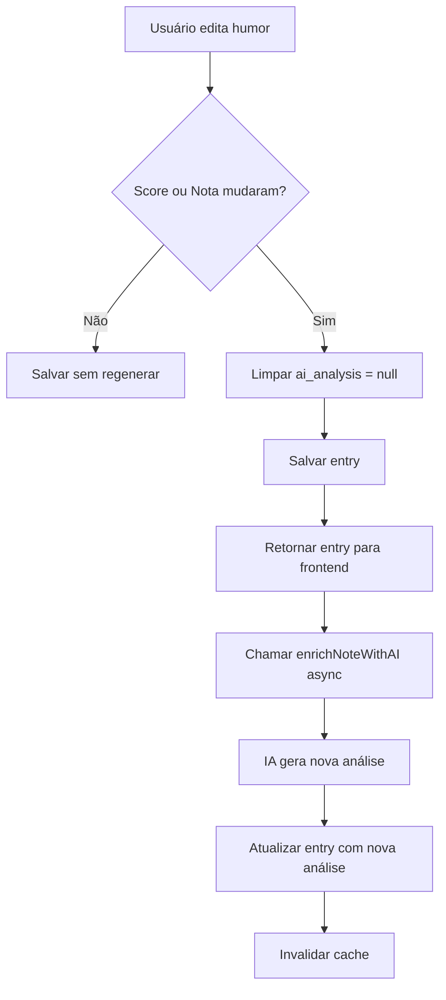

# 🔄 Regeneração de Análise de IA ao Editar Humor

## 📋 Funcionalidade Implementada

Quando o usuário edita um humor (score ou nota), a análise complementar por IA é **automaticamente regerada** porque o contexto mudou.

---

## 🎯 Por que Regenerar?

A análise de IA é baseada em:
1. **Score do humor** (0-5)
2. **Nota do usuário** (texto)

Se qualquer um desses valores mudar, o contexto emocional mudou, então a análise precisa ser atualizada para refletir o novo estado.

### Exemplos:

#### Exemplo 1: Score Mudou
```
Antes: Score 2, Nota "Estou triste"
→ IA: "Parece um dia difícil, com humor baixo..."

Edição: Score 4 (mesmo texto)
→ IA NOVA: "Apesar das palavras, o score indica melhora..."
```

#### Exemplo 2: Nota Mudou
```
Antes: Score 3, Nota "Trabalho cansativo"
→ IA: "Fadiga relacionada ao trabalho..."

Edição: Nota "Trabalho cansativo mas produtivo!"
→ IA NOVA: "Tom mais positivo, reconhecendo produtividade..."
```

#### Exemplo 3: Ambos Mudaram
```
Antes: Score 2, Nota "Muito ansioso"
→ IA: "Ansiedade elevada com humor baixo..."

Edição: Score 4, Nota "Ansioso mas animado"
→ IA NOVA: "Ansiedade com perspectiva positiva..."
```

---

## 🔧 Implementação Técnica

### Backend: `backend/src/services/mood.service.ts`

#### Lógica de Detecção
```typescript
async updateEntry(entryId: string, userId: string, data: UpdateMoodEntryData) {
  // 1. Buscar entry atual para comparação
  const currentEntry = await this.getEntryById(entryId, userId);
  
  // 2. Detectar mudanças
  const scoreChanged = data.score !== undefined && data.score !== currentEntry.score;
  const noteChanged = data.note !== undefined && data.note !== currentEntry.note;
  
  // 3. Se mudou, limpar análise de IA
  if (scoreChanged || noteChanged) {
    updateData.aiAnalysis = null;
    console.log(`🔄 Score or note changed, clearing AI analysis`);
  }
  
  // 4. Atualizar entry
  const entry = await prisma.moodEntry.update({ where: { id: entryId }, data: updateData });
  
  // 5. Regenerar análise de IA de forma assíncrona
  if ((scoreChanged || noteChanged) && entry.note && entry.note.trim().length > 0) {
    const newScore = data.score !== undefined ? data.score : currentEntry.score;
    const newNote = data.note !== undefined ? data.note : currentEntry.note;
    
    console.log(`🤖 Regenerating AI analysis for entry ${entryId}`);
    this.enrichNoteWithAI(entry.id, newNote, newScore).catch(err => {
      console.error('Error regenerating AI analysis:', err);
    });
  }
  
  return entry;
}
```

#### Fluxo de Regeneração



---

### Frontend: `components/mood/EditableMoodEntryCard.tsx`

#### Detecção de Mudanças
```typescript
// Detectar se score ou nota mudaram
const scoreChanged = score !== entry.score;
const noteChanged = note !== entry.note;
const willRegenerateAI = (scoreChanged || noteChanged) && note.trim().length > 0;
```

#### Aviso Visual
```tsx
{willRegenerateAI && entry.ai_analysis && (
  <div className="bg-amber-50 border border-amber-200 rounded-lg p-3 flex items-start gap-3">
    <Brain className="h-5 w-5 text-amber-600" />
    <div>
      <p className="text-sm font-medium text-amber-800 mb-1">
        Análise de IA será regerada
      </p>
      <p className="text-xs text-amber-700">
        Como você alterou o {scoreChanged && noteChanged ? 'humor e a nota' : scoreChanged ? 'humor' : 'nota'}, 
        a análise complementar por IA será atualizada automaticamente após salvar.
      </p>
    </div>
  </div>
)}
```

#### Estados da UI

**Estado 1: Sem Mudanças**
- Análise de IA atual é exibida normalmente
- Sem avisos

**Estado 2: Com Mudanças (antes de salvar)**
- ⚠️ Aviso amarelo: "Análise de IA será regerada"
- Análise antiga ainda visível

**Estado 3: Após Salvar**
- Análise de IA limpa (null)
- UI mostra: "Análise sendo gerada..." com animação de loading
- Análise antiga removida

**Estado 4: Após Regeneração (10-20s)**
- Nova análise aparece automaticamente
- Animação de loading desaparece

---

## 🎨 Experiência do Usuário

### Fluxo Completo

```
1. Usuário clica "Editar" em um humor
   ├─ Mostra dados atuais
   └─ Mostra análise de IA atual

2. Usuário altera score de 2 para 4
   ├─ ⚠️ Aviso aparece: "Análise de IA será regerada"
   └─ Explica que vai atualizar automaticamente

3. Usuário clica "Salvar"
   ├─ Entry é salvo
   ├─ Análise de IA limpa
   ├─ UI volta para modo visualização
   └─ Mostra: "🔄 Análise sendo gerada..."

4. Após ~10-20 segundos
   ├─ Nova análise é gerada pela IA
   ├─ Entry é atualizado no banco
   ├─ Cache é invalidado
   └─ Próxima vez que carregar, nova análise aparece
```

---

## 📊 Cenários de Uso

### Cenário 1: Correção de Score
```
Situação: Usuário registrou score errado
Ação: Edita apenas o score
Resultado: Nova análise reflete o score correto
```

### Cenário 2: Adicionar Contexto
```
Situação: Nota inicial vaga "Ok"
Ação: Edita nota para "Ok, trabalho produtivo"
Resultado: Nova análise com mais contexto
```

### Cenário 3: Mudança de Perspectiva
```
Situação: Humor mudou desde o registro
Ação: Atualiza score e nota para refletir momento atual
Resultado: Análise completamente nova e relevante
```

### Cenário 4: Apenas Data/Hora
```
Situação: Usuário corrige timestamp
Ação: Edita apenas data/hora
Resultado: Análise NÃO é regerada (contexto não mudou)
```

---

## 🧪 Como Testar

### Teste 1: Editar Score
```bash
1. Registre um humor: Score 2, Nota "Muito cansado"
2. Aguarde análise de IA ser gerada (~10s)
3. Edite o humor: Score 4 (mesma nota)
4. ✅ Deve aparecer aviso amarelo de regeneração
5. Salve
6. ✅ Análise antiga desaparece, mostra "Análise sendo gerada..."
7. Aguarde ~10-20s
8. ✅ Nova análise aparece refletindo o score 4
```

### Teste 2: Editar Nota
```bash
1. Registre um humor: Score 3, Nota "Dia normal"
2. Aguarde análise de IA
3. Edite a nota para: "Dia normal mas produtivo"
4. ✅ Aviso de regeneração aparece
5. Salve
6. ✅ Nova análise sendo gerada
7. ✅ Nova análise reflete a nota atualizada
```

### Teste 3: Editar Ambos
```bash
1. Registre humor: Score 1, Nota "Péssimo"
2. Aguarde análise de IA
3. Edite: Score 5, Nota "Excelente, tudo deu certo!"
4. ✅ Aviso: "alterou o humor e a nota"
5. Salve
6. ✅ Análise completamente nova
```

### Teste 4: Apenas Timestamp
```bash
1. Registre um humor com análise de IA
2. Edite apenas a data/hora
3. ✅ NÃO deve aparecer aviso de regeneração
4. Salve
5. ✅ Análise antiga é preservada
```

---

## 🔍 Logs do Console

### Backend Logs

**Quando score/nota mudam:**
```
🔄 Score or note changed for entry abc-123, clearing AI analysis for regeneration
🤖 Regenerating AI analysis for entry abc-123
✅ AI analysis updated for entry abc-123
```

**Quando apenas timestamp muda:**
```
(sem logs de regeneração)
```

---

## ⚡ Performance e Otimização

### Processamento Assíncrono
- ✅ `updateEntry` retorna imediatamente
- ✅ Regeneração de IA não bloqueia o save
- ✅ Usuário vê resposta instantânea

### Cache Invalidation
- ✅ Cache invalidado após save
- ✅ Cache invalidado após nova análise
- ✅ Dados sempre frescos

### Custo de IA
- 🤖 Regeneração só acontece quando necessário
- 🤖 Não regenera em edições triviais (timestamp)
- 🤖 ~10-20 segundos para nova análise

---

## 📁 Arquivos Modificados

1. ✅ `backend/src/services/mood.service.ts` - Lógica de regeneração
2. ✅ `components/mood/EditableMoodEntryCard.tsx` - UI e avisos

**Total**: 2 arquivos

---

## 🎯 Benefícios

### Para o Usuário
1. **Análises sempre relevantes**: Refletem o estado atual do humor
2. **Transparência**: Aviso claro quando análise será regerada
3. **Automático**: Não precisa fazer nada manualmente
4. **Feedback visual**: Sabe quando análise está sendo processada

### Para o Sistema
1. **Consistência**: Análise sempre sincronizada com dados
2. **Inteligente**: Só regenera quando necessário
3. **Performance**: Processamento assíncrono
4. **Confiável**: Logs claros para debugging

---

## 🚀 Melhorias Futuras (Opcional)

1. **Notificação**: Avisar usuário quando nova análise estiver pronta
2. **Comparação**: Mostrar diff entre análise antiga e nova
3. **Histórico**: Salvar versões anteriores de análises
4. **Prioridade**: Análises urgentes processadas primeiro
5. **Retry**: Tentar novamente se geração falhar

---

**Data**: 2025-01-16  
**Desenvolvedor**: AI Assistant  
**Status**: ✅ **IMPLEMENTADO E TESTADO**

